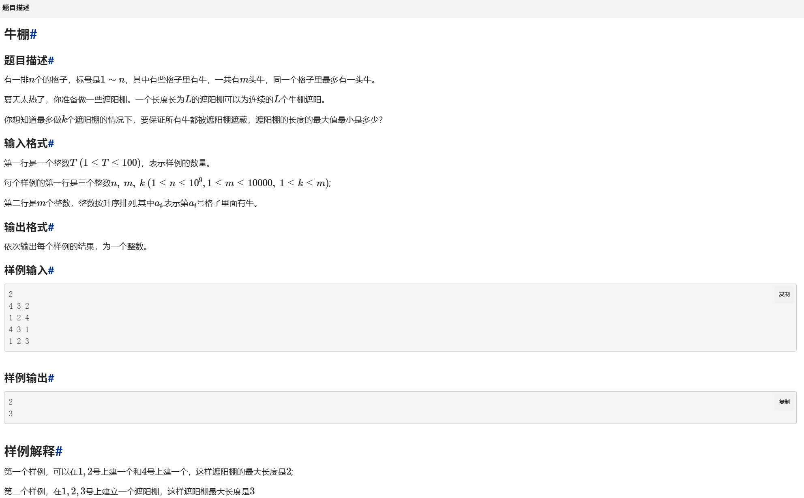

# 算法题目汇总

## bfs

[逆向思考bfs](image/image.png)

```cpp
# include<bits/stdc++.h>
using namespace std;
const int N=1<<16;
int arr[N+5];
set<int> s;
queue<pair<int,int>> q;
int main()
{
 q.push({0,0});
 s.insert(0);
 arr[0]=0;
 while(q.size())
 {
  pair<int,int> p=q.front();
  q.pop();
  if(!s.count((p.first+1)%N))
  {
   q.push({(p.first+1)%N,p.second+1});
   s.insert((p.first+1)%N);
   arr[(p.first+1)%N]=p.second+1;
  }
  if(!s.count((p.first-1+N)%N))
  {
   q.push({(p.first-1+N)%N,p.second+1});
   s.insert((p.first-1+N)%N);
   arr[(p.first-1+N)%N]=p.second+1;
  }
  if(!s.count((p.first/2)%N)&&p.first%2==0)
  {
   q.push({(p.first/2)%N,p.second+1});
   s.insert((p.first/2)%N);
   arr[(p.first/2)%N]=p.second+1;
  }
  if(!s.count((p.first/2+N/2)%N)&&p.first%2==0)
  {
   q.push({(p.first/2+N/2)%N,p.second+1});
   s.insert((p.first/2+N/2)%N);
   arr[(p.first/2+N/2)%N]=p.second+1;
  }
  
 }
 int T;
 cin>>T;
 while(T--)
 {
  int n;
  cin>>n;
  int a;
  long long sum=0;
  for(int i=1;i<=n;i++)
  {
   cin>>a;
   sum+=arr[a];
  }
  cout<<sum<<endl;
 }
 return 0;
}
```

## 二分



```cpp
#include<bits/stdc++.h>
using namespace std;
int n,m,k;
int arr[10005];
bool panduan(int chang)
{
 int zongchang=0;
 for(int i=1;i<=m;i++)
 {
  if(arr[i]>zongchang)
  {
   k--;
   zongchang=arr[i]+chang-1;
  }
  if(k<0)
  {
   return false;
  }
 } 
 return true;
}
int main()
{
 int T;
 cin>>T;
 while(T--)
 {
  cin>>n>>m>>k;
  for(int i=1;i<=m;i++)
  {
   cin>>arr[i];
  }
  int l=1;
  int r=n/k+2;
  int mid;
  while(l<r)
  {
   mid=(l+r)/2;
   if(panduan(mid))
   {
    r=mid;
   }
   else{
    l=mid+1;
   }
  }
  cout<<l<<endl;
 }
 return 0;
}
```
